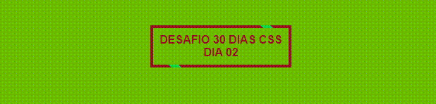

# Botão com efeito Hover 

Continuando com o desafio de 30 dias com CSS, o projeto de hoje foi esse de um botão com efeito ::hover

## Aprendizado
 1- Revisei o atributo <b>button </b>  
 2- Como usar o  <b>:before</b> e o <b>:after</b>  
 3- E o uso do <b>:hover</b> onde modifica  elemento quando passa o mouse
 